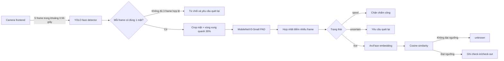

# Tài liệu AI – Nhận diện khuôn mặt có chống giả mạo

Tài liệu này giải thích phần AI của backend theo đúng source hiện tại. Mục tiêu là giúp thành viên nhóm hiểu hệ thống, chạy demo và trình bày trước hội đồng mà không nhầm lẫn giữa **phát hiện khuôn mặt**, **chống giả mạo** và **nhận dạng danh tính**.

## 1. Bài toán khoa học trung tâm

> Làm thế nào phân biệt khuôn mặt thật với ảnh in hoặc video phát lại trong điều kiện camera, ánh sáng và chất lượng ảnh thay đổi, đồng thời vẫn bảo đảm tốc độ xử lý gần thời gian thực trên thiết bị phổ thông?

Đây là bài toán **Face Presentation Attack Detection – Face PAD**. PAD không trả lời người trong ảnh là ai. Nó trả lời mẫu khuôn mặt đang quan sát có đến từ một người thật trước camera hay từ phương tiện giả mạo.

Hệ thống giải quyết hai bài toán độc lập:

1. **Liveness/PAD:** MobileNetV3-Small phân loại `live`, `spoof` hoặc `uncertain`.
2. **Nhận dạng:** ArcFace so khớp khuôn mặt thật với nhân viên đã đăng ký.

ArcFace không thể thay thế PAD. Một ảnh in rõ nét vẫn có thể tạo embedding ArcFace rất giống người thật. Vì vậy hệ thống luôn chạy PAD trước và chỉ chạy ArcFace khi PAD trả về `live`.

## 2. Phạm vi tấn công

Model hiện tại được xây dựng cho các kiểu tấn công 2D:

- Ảnh khuôn mặt được in trên giấy.
- Ảnh khuôn mặt hiển thị trên màn hình điện thoại hoặc máy tính.
- Video khuôn mặt được phát lại trên màn hình.

Model chưa được chứng minh cho mặt nạ 3D, deepfake thời gian thực, camera hồng ngoại hoặc các kiểu tấn công chưa xuất hiện trong dữ liệu. Khi thuyết trình cần nói rõ phạm vi này, tránh tuyên bố hệ thống chống được mọi hình thức giả mạo.

## 3. Kiến trúc tổng thể



Trình tự này có ý nghĩa bảo mật: hệ thống không xác định danh tính và không ghi công trước khi vượt qua kiểm tra PAD.

## 4. Vai trò của từng mô hình

### 4.1. YOLO – phát hiện vị trí khuôn mặt

YOLO nhận ảnh đầy đủ và trả về bounding box, nhãn cùng độ tin cậy. Backend chỉ chấp nhận frame có đúng một khuôn mặt để tránh việc PAD và ArcFace xử lý nhầm người.

Vùng crop được mở rộng thêm 30% quanh bounding box. Phần viền này giữ lại các dấu hiệu quan trọng của tấn công trình chiếu như mép giấy, moiré, phản xạ màn hình và sự khác biệt texture. Nếu crop quá sát, model chỉ nhìn thấy da/mặt và mất nhiều tín hiệu giả mạo.

Source liên quan:

- `app/detection/service.py`: tải YOLO, giải mã ảnh và suy luận.
- `app/detection/router.py`: REST/WebSocket detection.
- `app/recognition/router.py`: crop có padding và điều phối pipeline.

### 4.2. MobileNetV3-Small – chống giả mạo

MobileNetV3-Small là CNN nhẹ, phù hợp CPU phổ thông. Classifier cuối được thay bằng hai đầu ra theo thứ tự cố định:

```text
class 0 = spoof
class 1 = live
```

Đầu ra thô là hai logits. Backend áp dụng softmax để lấy xác suất live:

```text
p_live = exp(z_live) / (exp(z_spoof) + exp(z_live))
```

Tiền xử lý inference phải giống lúc train:

1. Resize về `160 × 160`.
2. Chuyển BGR sang RGB.
3. Đưa pixel về `[0, 1]`.
4. Chuẩn hóa bằng mean `[0.485, 0.456, 0.406]` và standard deviation `[0.229, 0.224, 0.225]`.

Model được export ONNX để backend chạy bằng ONNX Runtime mà không cần tải toàn bộ PyTorch trong môi trường production.

Source liên quan:

- `training/train_antispoof.py`: train, đánh giá và export ONNX.
- `app/antispoofing/service.py`: tiền xử lý, ONNX inference và quyết định trạng thái.
- `models/antispoofing/mobilenetv3_pad.onnx`: model runtime.

### 4.3. ArcFace – xác định người đó là ai

ArcFace biến khuôn mặt thành vector embedding. Khi đăng ký nhân viên, embedding được lưu trong bảng `employee_face_embeddings`. Khi chấm công, embedding truy vấn được so với toàn bộ embedding đã lưu bằng cosine similarity:

```text
similarity(q, e) = (q · e) / (||q|| × ||e||)
```

Nếu similarity lớn hơn hoặc bằng `FACE_RECOGNITION_THRESHOLD` thì trạng thái là `recognized`; nếu không thì là `unknown`. Ngưỡng hiện tại mặc định là `0.55`.

Source liên quan:

- `app/recognition/service.py`: ArcFace, embedding và so khớp.
- `app/recognition/model.py`: bảng embedding.
- `app/recognition/router.py`: enrollment và luồng chấm công.

## 5. Vì sao dùng nhiều frame?

Một frame có thể bị mờ, thiếu sáng hoặc bắt đúng thời điểm màn hình phát lại thay đổi. Frontend vì vậy gửi 5 frame. Backend cho phép từ 3 đến 16 frame và tính chất lượng từng frame:

```text
quality = 0.40 × sharpness
        + 0.25 × brightness
        + 0.15 × contrast
        + 0.20 × detector_confidence
```

Điểm live cuối là trung bình có trọng số:

```text
weight_i = quality_i / tổng quality
live_score = tổng(weight_i × p_live_i)
```

Độ bất định được đo bằng độ lệch chuẩn có trọng số:

```text
uncertainty = sqrt(tổng(weight_i × (p_live_i - live_score)^2))
```

Nếu các frame cho kết quả mâu thuẫn, uncertainty tăng. Điều này giúp hệ thống không tự tin sai khi chất lượng chuỗi ảnh không ổn định.

## 6. Ba trạng thái quyết định

Với cấu hình thử nghiệm hiện tại:

```dotenv
ANTI_SPOOF_SPOOF_THRESHOLD=0.45
ANTI_SPOOF_LIVE_THRESHOLD=0.65
ANTI_SPOOF_MAX_UNCERTAINTY=0.18
```

Quy tắc quyết định:

| Điều kiện | Trạng thái | Hành động |
| --- | --- | --- |
| `live_score <= 0.45` | `spoof` | Chặn, không chạy ArcFace, không ghi công. |
| `live_score >= 0.65` và `uncertainty <= 0.18` | `live` | Chạy ArcFace và có thể ghi công. |
| Các trường hợp còn lại | `uncertain` | Không ghi công, yêu cầu quét lại. |

Khoảng giữa hai ngưỡng là **reject option**. Đây là lựa chọn quan trọng: thay vì ép mọi mẫu thành thật hoặc giả, hệ thống thừa nhận các trường hợp chưa đủ bằng chứng. Cách này phù hợp với bài toán chấm công vì một lần quét lại ít nguy hiểm hơn chấp nhận nhầm ảnh giả.

## 7. Dữ liệu hiện tại

Dữ liệu mới nằm trong:

```text
data/
  train/<subject_id>/{live,spoof}/*.jpg
  validate/<subject_id>/{live,spoof}/*.jpg
  test/<subject_id>/{live,spoof}/*.jpg
```

Thống kê crop dùng cho train:

| Split | Live | Spoof | Tổng |
| --- | ---: | ---: | ---: |
| Train | 2.254 | 2.254 | 4.508 |
| Validation | 602 | 602 | 1.204 |
| Test | 522 | 522 | 1.044 |
| Tổng | 3.378 | 3.378 | 6.756 |

Dữ liệu cân bằng theo lớp nên sampler cân bằng không làm thay đổi tỷ lệ hiện tại.
Tên của cả 25 thư mục trong validation và test cũng xuất hiện trong train. Nếu
các tên này thật sự là subject ID, phải chia lại theo subject trước khi dùng kết
quả đánh giá; nếu không sẽ có data leakage và chỉ số cao giả tạo.

Training vẫn dùng `WeightedRandomSampler` để tiếp tục hoạt động đúng nếu tỷ lệ
hai lớp thay đổi ở lần cập nhật dữ liệu sau.

## 8. Quá trình train

### Chuẩn bị crop

```powershell
cd D:\doan\be
.\doan\Scripts\Activate.ps1

python -m training.prepare_antispoof_data `
  --input data/antispoof_raw `
  --output data/antispoof `
  --sample-every 5
```

Script chỉ ghi crop khi frame có đúng một khuôn mặt. Padding và confidence phải đồng nhất với pipeline runtime.

### Train chính thức

```powershell
python -m training.train_antispoof `
  --data data `
  --output models/antispoofing `
  --epochs 25 `
  --batch-size 32 `
  --image-size 160
```

Training sử dụng:

- Pretrained ImageNet để transfer learning.
- Cross-entropy loss cho hai lớp.
- AdamW optimizer.
- Cosine annealing learning-rate scheduler.
- Augmentation gồm crop ngẫu nhiên, lật ngang, thay đổi màu và Gaussian blur.
- Checkpoint được chọn theo ACER thấp nhất trên validation, không chọn theo test.

Đầu ra:

```text
models/antispoofing/mobilenetv3_pad.pt    # checkpoint PyTorch
models/antispoofing/mobilenetv3_pad.onnx  # model backend sử dụng
```

## 9. Chỉ số đánh giá

Trong PAD, accuracy không đủ vì hai loại lỗi có mức nguy hiểm khác nhau.

| Chỉ số | Ý nghĩa | Mong muốn |
| --- | --- | --- |
| APCER | Tỷ lệ mẫu tấn công bị nhận nhầm là thật. | Càng thấp càng tốt; liên quan trực tiếp đến bảo mật. |
| BPCER | Tỷ lệ người thật bị nhận nhầm là giả. | Càng thấp càng tốt; liên quan trải nghiệm người dùng. |
| ACER | Trung bình của APCER và BPCER. | Dùng để cân bằng hai loại lỗi. |
| Accuracy | Tỷ lệ dự đoán đúng tổng thể. | Chỉ dùng tham khảo khi dữ liệu lệch lớp. |

Công thức:

```text
APCER = số spoof bị chấp nhận / tổng số spoof
BPCER = số live bị từ chối / tổng số live
ACER  = (APCER + BPCER) / 2
```

Kết quả lần train smoke-test 5 epoch:

| Chỉ số | Validation tốt nhất | Test |
| --- | ---: | ---: |
| Accuracy | 0.4806 | 0.7592 |
| APCER | 0.6386 | 0.3491 |
| BPCER | 0.0893 | 0.0000 |
| ACER | 0.3639 | 0.1746 |

Kết quả này xác nhận pipeline hoạt động nhưng **chưa đủ tốt để công bố là model hoàn chỉnh**. APCER test 34,91% nghĩa là nếu dùng quy tắc phân lớp hai lớp trực tiếp, còn nhiều mẫu tấn công bị chấp nhận. Validation và test chênh lệch lớn cũng cho thấy dữ liệu chưa đủ đa dạng hoặc phân phối giữa các split chưa đồng đều.

## 10. API AI quan trọng

### Health check

```http
GET /api/v1/detection/health
GET /api/v1/recognition/health
GET /api/v1/recognition/anti-spoof/health
```

### Đăng ký ArcFace

```http
POST /api/v1/recognition/admin/employee/{employee_id}/enroll
Authorization: Bearer <admin-token>
```

### Chấm công đa frame

```http
POST /api/v1/recognition/attendance
Authorization: Bearer <token>
Content-Type: multipart/form-data
frames: <3 đến 16 file ảnh>
```

Ví dụ phần kết quả AI:

```json
{
  "faces": [
    {
      "liveness": {
        "status": "live",
        "liveScore": 0.836289,
        "spoofScore": 0.163711,
        "uncertainty": 0.081951,
        "frameCount": 5,
        "acceptedFrames": 5,
        "bestFrameIndex": 1,
        "inferenceMs": 19.76,
        "modelName": "mobilenetv3-small-pad"
      },
      "identity": {
        "status": "recognized",
        "employeeId": 1,
        "similarity": 0.72
      }
    }
  ]
}
```

Nếu liveness là `spoof` hoặc `uncertain`, identity có trạng thái `not_evaluated`. Đây là bằng chứng rằng ArcFace không được chạy và không có chấm công.

## 11. Cách demo trước hội đồng

Nên chuẩn bị cùng một người cho ba lần thử:

1. **Người thật:** đứng trước camera, ánh sáng vừa đủ. Kỳ vọng `live`, ArcFace nhận diện và ghi công.
2. **Ảnh in/ảnh trên điện thoại:** đặt trước camera. Kỳ vọng `spoof`, không chạy ArcFace.
3. **Điều kiện khó:** rung camera, che một phần mặt hoặc ánh sáng quá thấp. Kỳ vọng `uncertain`, hệ thống yêu cầu thử lại.

Trước demo, kiểm tra:

```powershell
Invoke-RestMethod http://127.0.0.1:8000/api/v1/detection/health
Invoke-RestMethod http://127.0.0.1:8000/api/v1/recognition/anti-spoof/health
```

Không nên chỉ demo một ảnh có sẵn. Điểm đáng trình bày là chuỗi nhiều frame, cơ chế bất định và việc ArcFace bị chặn khi mẫu không phải `live`.

## 12. Điểm khác biệt có thể trình bày

Không nên nói nhóm phát minh MobileNetV3 hoặc ArcFace. Phần thiết kế của đề tài nằm ở cách kết hợp và điều chỉnh cho bài toán chấm công:

- Pipeline hai tầng: PAD trước, nhận dạng sau.
- Quyết định trên chuỗi frame thay vì một ảnh đơn.
- Hợp nhất frame theo sharpness, brightness, contrast và confidence YOLO.
- Trạng thái `uncertain` để từ chối an toàn khi model thiếu chắc chắn.
- Chọn frame tốt nhất của chuỗi để đưa sang ArcFace.
- Dùng MobileNetV3-Small và ONNX Runtime nhằm giảm chi phí suy luận trên CPU.
- Tách subject giữa train/validation/test để đánh giá khả năng tổng quát hóa.

## 13. Hạn chế và hướng phát triển

Hạn chế hiện tại:

- Số subject và điều kiện thu thập còn ít.
- Số mẫu live/spoof mất cân bằng.
- Kết quả hiện tại cho thấy APCER còn cao.
- RGB texture có thể phụ thuộc loại camera và màn hình đã thấy khi train.
- Chưa đánh giá cross-device, cross-dataset và mặt nạ 3D.
- Ngưỡng `0.45/0.65` mới là ngưỡng thử nghiệm.

Ưu tiên cải tiến:

1. Thu thêm nhiều subject và nhiều camera nhưng giữ tách subject tuyệt đối.
2. Đa dạng ảnh in bóng/mờ, màn hình OLED/LCD, video nhiều độ phân giải và ánh sáng.
3. Báo cáo confusion matrix cùng APCER/BPCER/ACER theo từng loại tấn công.
4. Chọn ngưỡng trên validation bằng ROC/DET hoặc theo APCER mục tiêu; chỉ đánh giá test một lần sau khi khóa ngưỡng.
5. So sánh baseline: một frame với nhiều frame; trung bình thường với quality weighting; MobileNetV3 với một backbone nhẹ khác.
6. Nếu có dữ liệu video đủ lớn, thử mô hình temporal hoặc thêm optical flow/rPPG để khai thác chuyển động và tín hiệu sinh học.
7. Quantization INT8 và benchmark latency trên đúng thiết bị demo.

## 14. Kịch bản thuyết trình ngắn

Có thể trình bày phần AI trong khoảng 3 phút:

> Hệ thống chấm công khuôn mặt thông thường có một lỗ hổng: ArcFace chỉ xác định hai khuôn mặt có giống nhau hay không, nên ảnh in hoặc video rõ nét vẫn có thể vượt qua nhận dạng. Nhóm xác định bài toán AI cốt lõi là Face Presentation Attack Detection trong điều kiện camera và ánh sáng thay đổi trên thiết bị phổ thông.
>
> Pipeline của nhóm dùng YOLO để tìm mặt, sau đó MobileNetV3-Small phân tích texture để đánh giá thật giả. Frontend gửi một chuỗi 5 frame; backend gán trọng số cao hơn cho frame sắc nét, đủ sáng và có confidence tốt. Ngoài live và spoof, nhóm thêm trạng thái uncertain khi điểm nằm giữa hai ngưỡng hoặc các frame mâu thuẫn. Chỉ kết quả live mới được chuyển sang ArcFace để nhận dạng nhân viên và ghi công.
>
> MobileNetV3-Small được chọn vì mô hình nhẹ và được export sang ONNX để chạy nhanh trên CPU. Dữ liệu được tách theo người giữa train, validation và test nhằm hạn chế data leakage. Nhóm đánh giá bằng APCER, BPCER và ACER thay vì chỉ dùng accuracy. Kết quả hiện tại là smoke-test của pipeline; APCER còn cao nên hướng tiếp theo là mở rộng dữ liệu đa thiết bị, hiệu chỉnh ngưỡng và thực hiện ablation study cho cơ chế nhiều frame.

## 15. Câu hỏi phản biện thường gặp

**Tại sao đã có ArcFace vẫn cần MobileNetV3?**  
ArcFace đo độ giống danh tính, không xác định nguồn ảnh là người thật hay ảnh phát lại.

**Tại sao không ép model trả live/spoof mà cần uncertain?**  
Mẫu gần ranh giới hoặc chuỗi frame mâu thuẫn có rủi ro cao. Reject option cho phép hệ thống yêu cầu quét lại thay vì quyết định sai.

**Tại sao chọn MobileNetV3-Small?**  
Nó cân bằng kích thước, tốc độ CPU và khả năng học đặc trưng ảnh; phù hợp mục tiêu thiết bị phổ thông hơn backbone lớn.

**Accuracy 75,92% có đủ chưa?**  
Chưa. Với bảo mật, APCER quan trọng hơn accuracy. APCER hiện còn cao nên model này mới đủ để kiểm thử tích hợp.

**Điểm mới của nhóm là gì?**  
Không phải kiến trúc nền MobileNetV3 hay ArcFace, mà là pipeline PAD trước nhận dạng, hợp nhất đa frame theo chất lượng, trạng thái uncertain và triển khai ONNX thời gian thực trong hệ thống chấm công.

**Làm sao chứng minh nhiều frame tốt hơn?**  
Cần ablation study trên cùng test set: so sánh một frame, trung bình nhiều frame và quality-weighted fusion bằng APCER/BPCER/ACER cùng latency.
