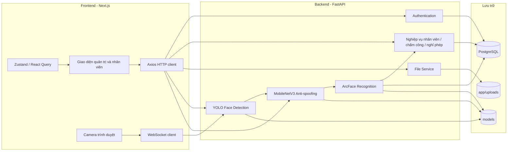
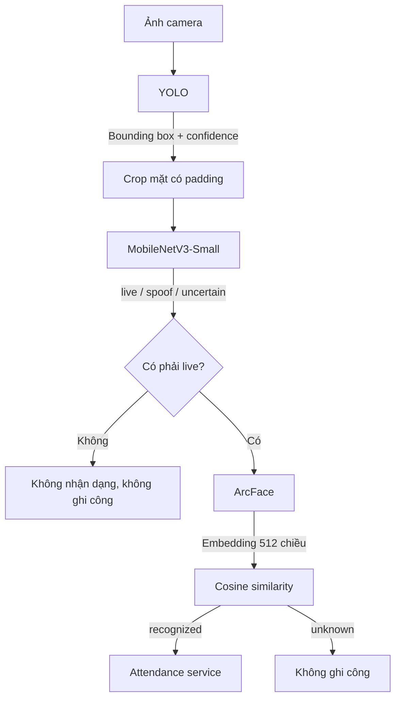
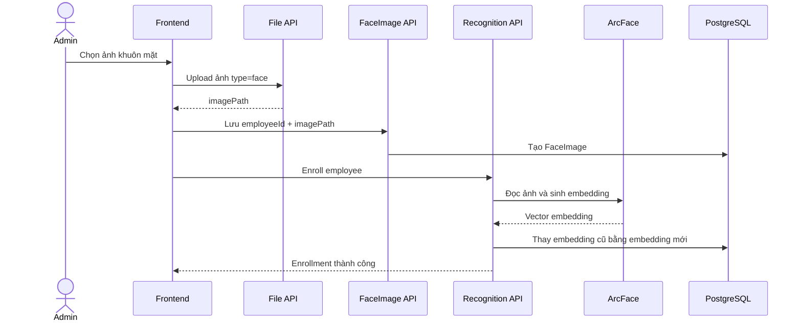
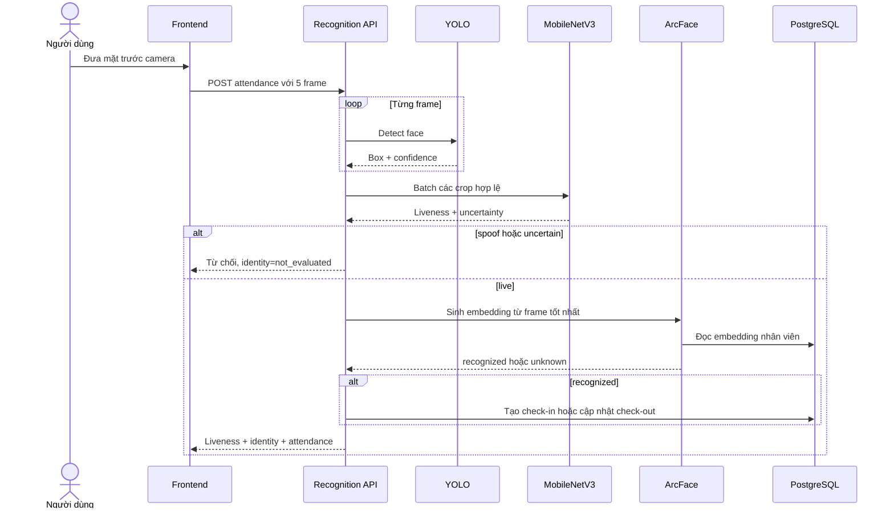
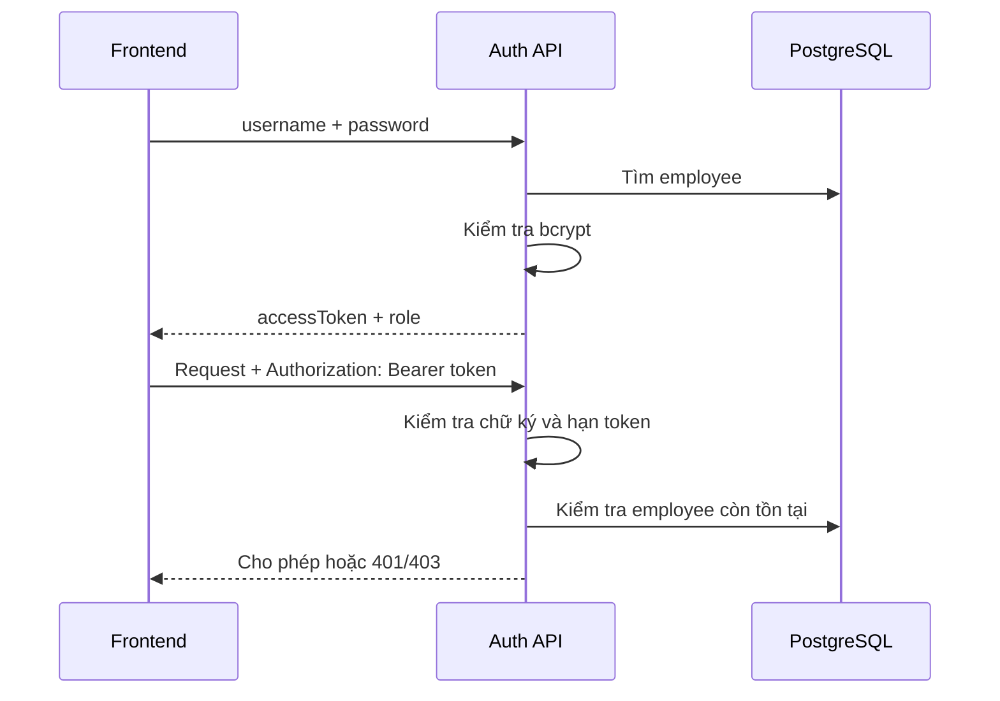
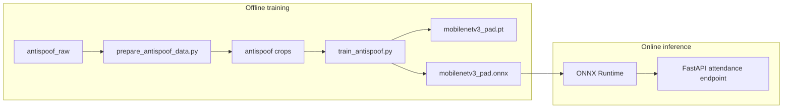

# Kiến trúc hệ thống chấm công khuôn mặt

Tài liệu này mô tả kiến trúc tổng thể của hệ thống: frontend, backend, cơ sở dữ liệu, lưu trữ file và các mô hình AI. Phần huấn luyện và thuật toán AI chuyên sâu được trình bày riêng trong [`AI_DOCUMENTATION.md`](AI_DOCUMENTATION.md).

## 1. Mục tiêu hệ thống

Hệ thống hỗ trợ:

- Quản lý nhân viên và tài khoản đăng nhập.
- Quản lý ảnh khuôn mặt dùng để đăng ký nhận dạng.
- Chấm công bằng khuôn mặt.
- Ngăn ảnh in hoặc video phát lại dùng để chấm công giả.
- Lưu lịch sử check-in/check-out theo ngày.
- Quản lý đơn nghỉ phép và tra cứu chấm công.
- Hoạt động trên trình duyệt và backend chạy được bằng CPU phổ thông.

## 2. Kiến trúc tổng quan

Hệ thống sử dụng kiến trúc client–server gồm bốn khối chính:



Nguyên tắc quan trọng nhất của luồng AI là:

```text
Phát hiện mặt → Kiểm tra thật/giả → Nhận dạng danh tính → Ghi công
```

Thứ tự này không được đảo ngược. ArcFace chỉ chạy khi MobileNetV3 xác nhận khuôn mặt là `live`.

## 3. Công nghệ sử dụng

| Tầng | Công nghệ | Vai trò |
| --- | --- | --- |
| Frontend | Next.js 16, React 19, TypeScript | Giao diện web và điều phối camera. |
| Giao tiếp HTTP | Axios | Đăng nhập, CRUD, upload và chấm công. |
| Giao tiếp thời gian thực | WebSocket | Gửi frame camera để YOLO vẽ bounding box. |
| State/data fetching | Zustand, React Query | Quản lý phiên đăng nhập và dữ liệu giao diện. |
| Backend | FastAPI | REST API, WebSocket và điều phối nghiệp vụ. |
| ORM | SQLAlchemy | Ánh xạ object Python với PostgreSQL. |
| Migration | Alembic | Quản lý thay đổi cấu trúc database. |
| Database | PostgreSQL | Nhân viên, embedding, chấm công và nghỉ phép. |
| Phát hiện mặt | YOLO/Ultralytics | Tìm vị trí khuôn mặt trong ảnh. |
| Chống giả mạo | MobileNetV3-Small, ONNX Runtime | Phân loại `live`, `spoof`, `uncertain`. |
| Nhận dạng | InsightFace/ArcFace | Sinh và so khớp embedding danh tính. |
| Xử lý ảnh | OpenCV, NumPy | Decode, crop, resize và chuẩn hóa ảnh. |

## 4. Kiến trúc frontend

Frontend nằm trong thư mục `fe` và sử dụng Next.js App Router.

```text
fe/src/
├── app/                 # Các route/page của Next.js
├── views/               # Màn hình quản trị và nhân viên
├── api/                 # Hàm gọi REST API
├── hooks/               # Hook camera và WebSocket detection
├── lib/                 # Axios, auth, kiểu dữ liệu và tiện ích
├── components/          # Thành phần giao diện dùng chung
└── stores/              # State dùng chung
```

### 4.1. Hai luồng camera khác nhau

Trang chấm công dùng camera cho hai nhiệm vụ:

1. **Preview detection:** gửi từng frame qua WebSocket `/detection/ws/faces`. YOLO trả bounding box để frontend hướng dẫn người dùng đặt mặt đúng vị trí.
2. **Chấm công:** khi điều kiện phù hợp, frontend chụp 5 frame liên tiếp và gửi một request multipart đến `/recognition/attendance`.

Detection WebSocket chỉ hỗ trợ trải nghiệm giao diện; nó không ghi công. Request attendance mới là luồng có PAD, ArcFace và cập nhật database.

### 4.2. Xử lý kết quả AI

Frontend hiển thị ba nhánh:

- `live`: hiển thị nhân viên được ArcFace nhận dạng và kết quả chấm công.
- `spoof`: cảnh báo phát hiện ảnh in/video phát lại.
- `uncertain`: yêu cầu đứng yên, cải thiện ánh sáng và quét lại.

## 5. Kiến trúc backend

Backend nằm trong thư mục `be/app`. `app/main.py` tạo FastAPI application, cấu hình CORS, mount thư mục upload và đăng ký các router.

```text
be/app/
├── main.py              # Điểm khởi tạo FastAPI
├── database.py          # Engine, session và SQLAlchemy Base
├── auth/                # Đăng nhập, JWT và phân quyền
├── employee/            # CRUD nhân viên
├── faceImage/           # Ảnh đăng ký khuôn mặt
├── attendance/          # Check-in/check-out
├── leaveRequest/        # Đơn nghỉ phép
├── file/                # Upload, đọc và xóa file
├── detection/           # YOLO face detection
├── antispoofing/        # MobileNetV3 PAD
├── recognition/         # ArcFace và điều phối chấm công
└── uploads/             # File avatar/face được upload
```

Mỗi module nghiệp vụ thường gồm:

- `router.py`: định nghĩa endpoint và kiểm tra request.
- `schema.py`: Pydantic request/response model.
- `model.py`: SQLAlchemy database model nếu module có bảng.
- `crud.py`: truy vấn và cập nhật database.
- `service.py`: xử lý nghiệp vụ hoặc AI không thuộc CRUD.

### 5.1. Các router chính

| Prefix | Chức năng |
| --- | --- |
| `/api/v1/auth` | Đăng nhập và lấy thông tin tài khoản hiện tại. |
| `/api/v1/admin/employee` | CRUD nhân viên dành cho admin. |
| `/api/v1/admin/employee/face-images` | Quản lý ảnh đăng ký. |
| `/api/v1/file/uploads` | Upload, đọc và xóa ảnh. |
| `/api/v1/detection` | Health check, REST detection và WebSocket detection. |
| `/api/v1/recognition` | Enrollment ArcFace, health check và chấm công đa frame. |
| `/api/v1/employee/attendance` | Lịch sử chấm công của nhân viên. |
| `/api/v1/admin/attendance` | Lịch sử chấm công dành cho admin. |
| `/api/v1/employee/leave-request` | Tạo/sửa/xóa/xem đơn nghỉ của nhân viên. |
| `/api/v1/admin/leave-request` | Admin xem và duyệt đơn nghỉ. |

## 6. Tầng AI trong backend

Ba thành phần AI có trách nhiệm tách biệt:



### 6.1. YOLO detector

- Model: `models/yolov8n-face.pt`.
- Input: bytes JPEG, PNG hoặc WebP.
- Output: bounding box, confidence và kích thước ảnh.
- Backend chỉ sử dụng frame có đúng một khuôn mặt cho chấm công.

### 6.2. MobileNetV3 PAD

- Model runtime: `models/antispoofing/mobilenetv3_pad.onnx`.
- Input: batch crop RGB `160 × 160`.
- Output: logits theo thứ tự `[spoof, live]`.
- Kết hợp nhiều frame bằng trọng số chất lượng.
- Trả `live`, `spoof` hoặc `uncertain`.

### 6.3. ArcFace recognizer

- Model mặc định: InsightFace `buffalo_l`.
- Sinh embedding khuôn mặt khi enrollment và khi nhận dạng.
- So khớp bằng cosine similarity.
- Ngưỡng hiện tại: `0.55` nếu `.env` không cấu hình khác.

Các model được khởi tạo theo kiểu singleton và lazy loading: object service tồn tại suốt vòng đời ứng dụng nhưng trọng số chỉ được tải khi inference lần đầu. Cách này làm backend khởi động nhanh hơn và tránh nạp nhiều bản model vào RAM.

## 7. Hai luồng nghiệp vụ quan trọng

### 7.1. Đăng ký khuôn mặt nhân viên



Một nhân viên hiện có tối đa một bản ghi `FaceImage`. Enrollment tạo lại embedding từ ảnh đã đăng ký để tránh embedding cũ không còn đồng bộ với ảnh.

### 7.2. Chấm công đa frame



Nếu ít hơn ba frame có đúng một mặt, request bị từ chối. Nếu PAD không trả `live`, ArcFace không được gọi.

## 8. Kiến trúc dữ liệu

```mermaid
erDiagram
    EMPLOYEES ||--o| FACE_IMAGE : has
    EMPLOYEES ||--o{ FACE_EMBEDDINGS : has
    EMPLOYEES ||--o{ ATTENDANCES : records
    EMPLOYEES ||--o{ LEAVE_REQUESTS : creates

    EMPLOYEES {
        int id PK
        string username UK
        string password
        string fullname
        string role
    }

    FACE_IMAGE {
        int id PK
        int employeeId FK_UK
        string imagePath
    }

    FACE_EMBEDDINGS {
        int id PK
        int employeeId FK
        json embedding
        string imagePath
        string modelName
    }

    ATTENDANCES {
        int id PK
        int employeeId FK
        date attendanceDate
        string checkIn
        string checkOut
    }

    LEAVE_REQUESTS {
        int id PK
        int employeeId FK
        date startDate
        date endDate
        string status
    }
```

Các ràng buộc đáng chú ý:

- `employees.username` là duy nhất.
- Mỗi nhân viên có tối đa một `FaceImage`.
- Mỗi nhân viên có tối đa một dòng attendance cho một ngày.
- Khi xóa nhân viên, các ảnh mặt, embedding, attendance và đơn nghỉ liên quan được cascade.
- Embedding được lưu dưới dạng JSON để đơn giản hóa triển khai đồ án. Với hệ thống lớn có thể chuyển sang PostgreSQL `pgvector`.

## 9. Lưu trữ file và model

```text
be/
├── app/uploads/
│   ├── avatar/          # Ảnh đại diện
│   └── face/            # Ảnh dùng cho enrollment
├── models/
│   ├── yolov8n-face.pt
│   ├── antispoofing/
│   │   ├── mobilenetv3_pad.pt
│   │   └── mobilenetv3_pad.onnx
│   └── insightface/
└── data/
    ├── antispoof_raw/   # Dữ liệu gốc có split
    └── antispoof/       # Crop dùng để train
```

Ảnh upload và model nằm trên filesystem; database chỉ lưu đường dẫn hoặc embedding. Dữ liệu train cùng checkpoint MobileNetV3 sinh ra đã được `.gitignore`. Thư mục upload hiện chưa được ignore toàn bộ, vì vậy không được commit ảnh khuôn mặt thật lên repository công khai.

## 10. Xác thực và phân quyền

Backend dùng Bearer token theo định dạng JWT ký bằng HMAC SHA-256.



Hai dependency chính:

- `get_current_employee`: yêu cầu token hợp lệ.
- `require_admin`: ngoài token hợp lệ còn yêu cầu `role=admin`.

Endpoint chấm công cần đăng nhập nhưng khuôn mặt được nhận dạng không bắt buộc phải trùng với tài khoản trong token. Thiết kế này phù hợp mô hình một terminal dùng chung cho nhiều nhân viên.

## 11. Xử lý đồng thời và hiệu năng

FastAPI xử lý request bất đồng bộ, còn inference AI và thao tác đồng bộ được đưa vào thread pool để không chặn event loop.

Các lock bảo vệ quá trình lazy loading. Inference YOLO và ONNX hiện cũng được tuần tự hóa bằng lock khi dùng chung model/session; instance ArcFace được tái sử dụng sau khi tải. Mỗi loại model chỉ được nạp một lần để tiết kiệm RAM.

Các quyết định tối ưu hiện tại:

- MobileNetV3-Small thay cho backbone lớn.
- Input PAD chỉ `160 × 160`.
- ONNX Runtime cho inference production.
- Suy luận nhiều crop trong một batch.
- Chỉ chạy ArcFace sau khi PAD trả `live`.
- Chọn một frame tốt nhất để ArcFace xử lý.
- WebSocket detection chờ response trước khi gửi frame tiếp theo.

## 12. Xử lý lỗi và trạng thái an toàn

| Trường hợp | Phản hồi |
| --- | --- |
| File không phải JPEG/PNG/WebP | HTTP 415. |
| File rỗng, quá lớn hoặc decode lỗi | HTTP 400. |
| Không đủ frame có đúng một mặt | HTTP 400. |
| Thiếu model hoặc runtime AI | HTTP 503. |
| PAD trả `spoof` | Không chạy ArcFace, không ghi công. |
| PAD trả `uncertain` | Không chạy ArcFace, yêu cầu quét lại. |
| ArcFace không tìm thấy người phù hợp | `identity.status=unknown`, không ghi công. |
| Token không hợp lệ | HTTP 401. |
| Không có quyền admin | HTTP 403. |

Nguyên tắc là **fail closed**: khi hệ thống không chắc chắn hoặc model gặp lỗi, chấm công không được ghi.

## 13. Kiến trúc train và inference tách biệt



PyTorch và TorchVision chỉ cần trong môi trường train. Backend production sử dụng file ONNX cùng `onnxruntime`. Việc tách hai môi trường giúp giảm dependency và tài nguyên khi triển khai.

## 14. Cấu hình triển khai

Các biến môi trường quan trọng:

| Biến | Thành phần |
| --- | --- |
| `DATABASE_URL` | Kết nối PostgreSQL. |
| `JWT_SECRET_KEY` | Khóa ký token. |
| `CORS_ORIGINS` | Danh sách frontend được gọi backend. |
| `YOLO_FACE_MODEL_PATH` | Checkpoint detector. |
| `YOLO_DEVICE` | CPU hoặc GPU cho YOLO. |
| `YOLO_PREVIEW_IMAGE_SIZE` | Kích thước YOLO nhẹ hơn cho preview camera. |
| `ANTI_SPOOF_MODEL_PATH` | File MobileNetV3 ONNX. |
| `ANTI_SPOOF_LIVE_THRESHOLD` | Ngưỡng chấp nhận live. |
| `ANTI_SPOOF_SPOOF_THRESHOLD` | Ngưỡng kết luận spoof. |
| `ANTI_SPOOF_MAX_UNCERTAINTY` | Bất định tối đa cho live. |
| `ARCFACE_MODEL_ROOT` | Thư mục model InsightFace. |
| `FACE_RECOGNITION_THRESHOLD` | Ngưỡng cosine similarity. |
| `APP_TIMEZONE` | Múi giờ tính ngày chấm công. |

Kiến trúc chạy local hiện tại:

```text
Browser :3000  ──HTTP/WS──>  FastAPI :8000  ──SQL──>  PostgreSQL :5432
                                  │
                                  ├── app/uploads
                                  └── models
```

Trong production nên đặt reverse proxy HTTPS phía trước frontend/backend, dùng `wss://` cho camera detection và giới hạn `CORS_ORIGINS` thay vì `*`.

## 15. Điểm mạnh và giới hạn kiến trúc

### Điểm mạnh

- Chia module rõ theo nghiệp vụ.
- Tách PAD và nhận dạng danh tính thành hai tầng độc lập.
- Không ghi công khi AI không chắc chắn.
- Luồng đa frame ổn định hơn xử lý một ảnh.
- Model được lazy-load và tái sử dụng.
- Có REST API, WebSocket và schema OpenAPI tự động.
- Có migration database bằng Alembic.

### Giới hạn

- File và model đang lưu cục bộ, chưa phù hợp nhiều backend instance.
- Embedding lưu JSON khiến tìm kiếm tuyến tính khi số nhân viên lớn.
- Mỗi request ArcFace hiện đọc toàn bộ embedding để so khớp.
- Chưa có message queue hoặc worker inference riêng.
- WebSocket detection chưa yêu cầu xác thực.
- Model PAD hiện vẫn cần cải thiện độ chính xác và dữ liệu.

Nếu mở rộng hệ thống, có thể dùng object storage cho ảnh, `pgvector` hoặc vector database cho embedding, Redis cho cache, worker inference riêng và reverse proxy cân bằng tải.

## 16. Cách trình bày kiến trúc trong 2 phút

> Hệ thống sử dụng kiến trúc client–server. Frontend Next.js quản lý giao diện, camera và gửi dữ liệu bằng HTTP hoặc WebSocket. Backend FastAPI chia thành các module xác thực, nhân viên, file, chấm công, nghỉ phép và ba module AI.
>
> Trong luồng chấm công, WebSocket YOLO giúp người dùng đặt mặt đúng vị trí. Khi quét, frontend gửi 5 frame đến backend. YOLO tìm và crop khuôn mặt, MobileNetV3 kiểm tra thật giả trên toàn bộ chuỗi. Nếu kết quả là spoof hoặc uncertain, hệ thống dừng ngay. Chỉ khi live, ArcFace mới sinh embedding, so khớp với PostgreSQL và ghi check-in hoặc check-out.
>
> Kiến trúc tách quá trình train và inference. PyTorch được dùng offline để huấn luyện, còn backend chạy model ONNX nhẹ hơn. Các model được lazy-load và tái sử dụng để tiết kiệm RAM. Cách tổ chức này làm rõ trách nhiệm từng thành phần, tăng an toàn và phù hợp thiết bị phổ thông.
